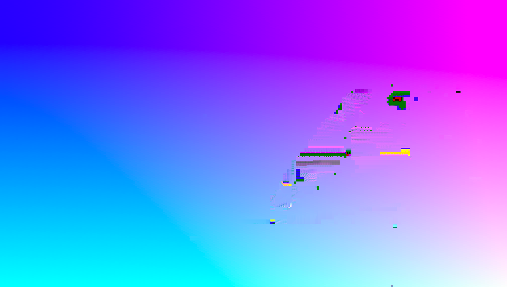

# rdm-jpg

Extra JPEG File

Must be a multiple of 16 in width and height.

| marker | description |
| ---- | ---- |
| APP3 | update flag |
| APP4 | coding mode | 
| APP5 | x-axis mv |
| APP6 | y-axis mv |
| APP7 | jpeg compression quality |

### update flag

bytes : `((width>>3))*((height>>3))>>3`

	(n)|(n+1)<<1|(n+2)<<2|(n+3)<<3|(n+4)<<4|(n+5)<<5|(n+6)<<6|(n+7)<<7

### coding mode

bytes : `((width>>3))*((height>>3))>>1`

	(n)|(n+1)<<4

| value | coding  mode | 
| :--: | ---- |
| 0 | golden frame | 
| 1 | golden frame + MV | 
| 2 | inter frame | 
| 3 | inter frame + MV | 
| 4 | intra frame |

### x-axis mv / y-axis mv

bytes : `((width>>3))*((height>>3))`   
mv ranges from `-128`~`127` 

### jpeg compression quality 

bytes : `1`   
quality ranges from `0`~`100`

### pixel data

difference YUV pixel value between two frames   

bytes : `width*heigh*3`   
value ranges from `-255/2`~`255/2  `  

### decode

 
### see also

[rdm03.js](https://mizt.github.io/blog/?id=rdm03)
